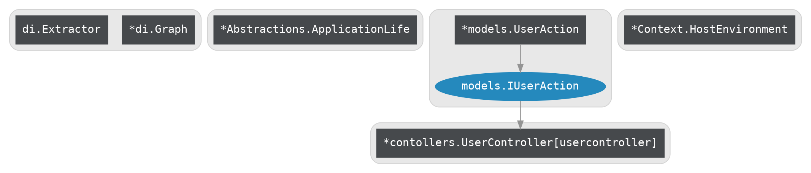

## 健康检查终结点
使用**Endpoints.UseViz** 可以为应用程序及路由添加健康检查的Endpoint用于Http输出应用状态  

## 实例
```golang
func main() {
    YoyoGo.CreateDefaultBuilder(func(rb router.IRouterBuilder) {
        endpoints.UseViz(rb)
    }).Build().Run()       //默认端口号 :8080	
}
```

## 访问地址
1.  输出依赖图   :  /actuator/graph?type=viz   
2.  依赖图字符串 :  /actuator/graph

## 返回值
### type=viz返回值

### 默认返回值 
